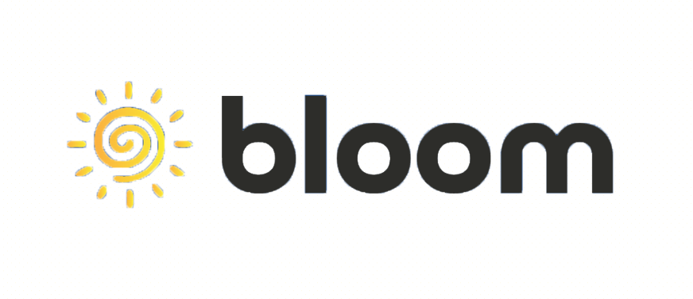
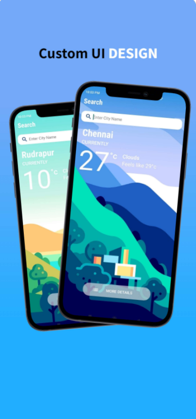
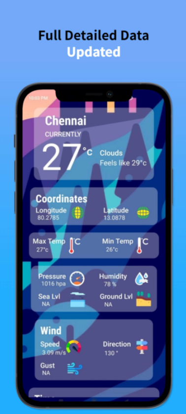

  

  <h3 align="center">Bloom</h3>

  

    A Weather App
     

  

  
Table of Contents

  <ol>
    <li>
      <a href="#about-the-project">About The Project</a>
    </li>
    <li><a href="#more-details">More Details</a></li>
    <li><a href="#license">License</a></li>
    <li><a href="#contact">Contact</a></li>
  </ol>

<!-- ABOUT THE PROJECT -->
## About The Project

Discover a reliable, real-time forecast that will always warn you about upcoming severe weather. Weather Underground combines data from OpenWeatherMap weather stations and a proprietary forecast model to give you the most accurate and forecasts, at a microclimate level. Discover about current conditions, get customizable severe weather alerts and much more. You’ll always be prepared for whatever the weather brings.

            

Hourly weather updates.
- See hourly updates for the weather with temperature, wind speed
- Useful Widgets to see important information on your homescreen

Other features:
- Sunrise sunset timings
- Rain forecast
- Fog forecast
- Wind speed and direction updates
- Real Feel temperature updates
- Atmospheric pressure
- Humdity
- Ground level and Sea level

<!-- MORE DETAILS -->
## More Details

Click on the Image to visit My Blog for more Details about the App.

<a href="https://hrkdev.blogspot.com/2021/11/alfred-movie-review-app.html"></img></a>

<!-- LICENSE -->
## License

Distributed under the HrkDev License.

<!-- CONTACT -->
## Contact

Hritik - [@hrk_kenoff](https://www.instagram.com/hrk_kenoff/) - lit2020076@iiitl.ac.in

Blog Link: [https://hrkdev.blogspot.com/](https://hrkdev.blogspot.com/)
